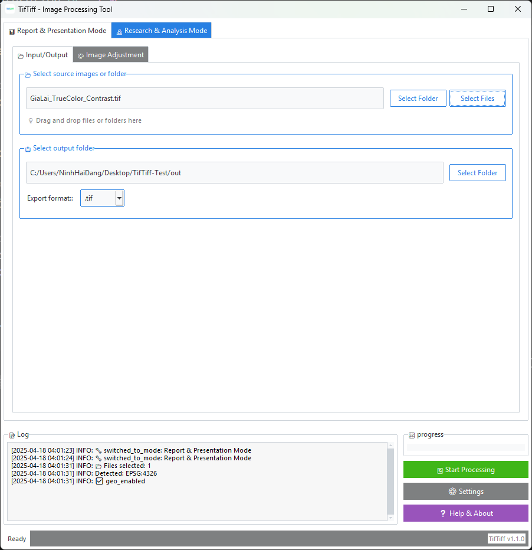

# TifTiff - Tif/Tiff Image Processing Tool | Phần mềm xử lý ảnh Tif/Tiff


## Tiếng Việt | Vietnamese

TifTiff là công cụ mạnh mẽ, thân thiện với người dùng để xử lý và chuyển đổi các tệp hình ảnh, với khả năng đặc biệt xử lý dữ liệu không gian địa lý ở định dạng GeoTIFF. Phần mềm được phát triển với Python và sử dụng kiến trúc MVC hiện đại.

### Ảnh chụp màn hình
<p align="center">
  
</p>
<p align="center">
  
</p>
<p align="center">
  
</p>
<p align="center">
  
</p>
<p align="center">
  
</p>
<p align="center">
  
</p>

### Tính năng

#### Xử lý ảnh cơ bản
- Chuyển đổi giữa các định dạng hình ảnh (PNG, JPEG, TIFF, JPEG2000)
- Thay đổi kích thước với tỷ lệ tùy chỉnh
- Xóa nền đen hoặc trắng với thuật toán tối ưu
- Điều chỉnh độ sáng, độ tương phản và độ bão hòa
- Tự động tối ưu hóa độ phân giải
- Tùy chọn nén mới cho đầu ra GeoTIFF
- Xử lý hàng loạt với đa luồng

#### Xử lý dữ liệu không gian địa lý
- Chuyển đổi giữa các hệ tọa độ (EPSG:4326, EPSG:3857, v.v.)
- Bảo toàn metadata không gian địa lý khi chuyển đổi
- Hỗ trợ nhiều định dạng đầu ra (GeoTIFF, GeoJPEG2000, ERDAS Imagine)
- Tự động phát hiện và xử lý hệ tọa độ không chuẩn
- Tối ưu hóa chuyển đổi hệ tọa độ với concurrent.futures

#### Quản lý metadata
- Trích xuất và xem metadata với xử lý đa luồng
- Xuất metadata sang CSV hoặc JSON
- Hỗ trợ EXIF và thông tin không gian địa lý
- Cấu trúc dữ liệu tối ưu cho file lớn

#### Hiệu suất và Tối ưu hóa
- Xử lý đa luồng cho tác vụ nặng
- Hệ thống cache thông minh
- Quản lý bộ nhớ hiệu quả
- Ghi log không đồng bộ
- Tối ưu hóa với NumPy

#### Giao diện người dùng
- Thiết kế dựa trên tab trực quan
- Chủ đề sáng và tối với ttkbootstrap
- Hỗ trợ đa ngôn ngữ (Tiếng Anh, Tiếng Việt)
- Theo dõi tiến trình chi tiết
- Hỗ trợ kéo và thả với tkinterdnd2
- Giao diện không đóng băng khi xử lý

### Cấu trúc dự án
```
TifTiff/
├── app.py              # Điểm khởi chạy chính
├── processing/         # Module xử lý
│   ├── image_processor.py
│   ├── geo_processor.py
│   └── metadata_processor.py
├── ui/                 # Giao diện người dùng
├── utils/             # Tiện ích và công cụ
├── resources/         # Tài nguyên và hằng số
└── requirements.txt   # Dependencies
```

### Yêu cầu hệ thống
- Python 3.8 trở lên
- Các gói Python cần thiết:
  - Pillow >= 9.0.0
  - Rasterio >= 1.3.0
  - NumPy >= 1.22.0
  - ttkbootstrap >= 1.10.0
  - tkinterdnd2 >= 0.3.0

### Cài đặt

#### Phương pháp 1: Chạy từ mã nguồn
1. Sao chép kho lưu trữ:
   ```
   git clone https://github.com/ninhhaidang/TifTiff.git
   ```

2. Cài đặt dependencies:
   ```
   pip install -r requirements.txt
   ```

3. Chạy ứng dụng:
   ```
   python app.py
   ```

#### Phương pháp 2: Tải xuống tệp thực thi
1. Tải phiên bản mới nhất từ [Releases](https://github.com/ninhhaidang/TifTiff/releases)
2. Giải nén tệp zip
3. Chạy `TifTiff.exe`

### Hướng dẫn sử dụng

#### Xử lý ảnh cơ bản
1. Chọn ảnh nguồn hoặc thư mục (hỗ trợ kéo thả)
2. Chọn thư mục đầu ra
3. Cấu hình tùy chọn xử lý
4. Nhấp "Bắt đầu xử lý"

#### Xử lý không gian địa lý
1. Chọn ảnh GeoTIFF nguồn
2. Cấu hình chuyển đổi hệ tọa độ trong tab "Hệ tọa độ"
3. Chọn định dạng đầu ra và tùy chọn bảo toàn metadata
4. Nhấp "Bắt đầu xử lý"

#### Xuất metadata
1. Chọn ảnh hoặc thư mục
2. Chọn định dạng xuất (CSV/JSON) trong tab "Tùy chọn"
3. Nhấp "Xuất metadata"

### Cấu hình
- Tự động lưu cài đặt giữa các phiên
- Quản lý cache thông minh
- Tùy chọn ghi log

### Giấy phép
Phần mềm này được phát hành theo [Giấy phép MIT](LICENSE).

### Công nhận
TifTiff được phát triển bởi [Ninh Hải Đăng] với các thư viện mã nguồn mở:
- [Pillow](https://python-pillow.org/) - Xử lý ảnh
- [Rasterio](https://rasterio.readthedocs.io/) - Xử lý dữ liệu địa lý
- [NumPy](https://numpy.org/) - Tối ưu hóa tính toán
- [ttkbootstrap](https://ttkbootstrap.readthedocs.io/) - Giao diện hiện đại
- [tkinterdnd2](https://pypi.org/project/tkinterdnd2/) - Hỗ trợ kéo thả

---

## English | Tiếng Anh

TifTiff is a powerful, user-friendly tool for processing and converting image files, with special capabilities for handling geospatial data in GeoTIFF format.

### Screenshots
<p align="center">
  
</p>
<p align="center">
  
</p>
<p align="center">
  
</p>
<p align="center">
  
</p>
<p align="center">
  
</p>
<p align="center">
  
</p>

### Features

- **Basic Image Processing**:
  - Convert between different image formats (PNG, JPEG, TIFF, JPEG2000, etc.)
  - Resize images with custom scaling
  - Remove black or white backgrounds
  - Adjust brightness, contrast, and saturation
  - Automatic resolution optimization
  - New compression options for GeoTIFF output

- **Geospatial Processing**:
  - Convert between different coordinate systems (EPSG:4326, EPSG:3857, etc.)
  - Preserve geospatial metadata when converting formats
  - Support for multiple geospatial output formats (GeoTIFF, GeoJPEG2000, ERDAS Imagine)
  - Automatic coordinate system detection
  - Improved support for non-standard EPSG coordinate systems

- **Metadata Handling**:
  - Extract and view image metadata
  - Export metadata to CSV or JSON formats
  - Comprehensive metadata support for EXIF and geospatial information
  - Improved metadata extraction capabilities for large files

- **Performance**:
  - Enhanced processing speed for large image files
  - Optimized memory usage during batch processing
  - Improved stability when processing multiple files simultaneously

- **User Interface**:
  - Intuitive tab-based interface
  - Dark and light themes
  - Multiple language support (English, Vietnamese)
  - Progress tracking and detailed logs
  - Drag and drop support
  - Fixed UI glitches when changing language

### Installation

#### Requirements
- Python 3.8 or higher
- Required Python packages:
  - PIL/Pillow
  - Rasterio
  - NumPy
  - ttkbootstrap
  - tkinterdnd2

#### Method 1: Run from Source
1. Clone this repository:
   ```
   git clone https://github.com/ninhhaidang/TifTiff.git
   ```

2. Install the required dependencies:
   ```
   pip install -r requirements.txt
   ```

3. Run the application:
   ```
   python app.py
   ```

#### Method 2: Download Executable
1. Download the latest release from the [Releases](https://github.com/ninhhaidang/TifTiff/releases) page
2. Extract the zip file to your desired location
3. Run `TifTiff.exe`

### Usage

#### Basic Image Processing
1. Select the source image(s) or folder using the "Select Files" or "Select Folder" buttons
2. Choose an output folder where processed images will be saved
3. Set your desired output format and scaling options
4. Use the "Advanced" tab to adjust brightness, contrast, and saturation if needed
5. Click "Start Processing" to begin the conversion

#### Geospatial Processing
1. Select GeoTIFF source images
2. Go to the "Coordinates" tab and enable coordinate system transformation
3. Select your target coordinate system
4. Choose whether to preserve geospatial information in the output
5. Select your preferred geospatial output format
6. Click "Start Processing" to begin the conversion

#### Exporting Metadata
1. Select the source image(s) or folder
2. Go to the "Options" tab
3. Click "Export CSV" or "Export JSON" to extract and save the metadata

### Configuration
TifTiff automatically saves your settings between sessions, including:
- Theme preferences
- Language selection
- Last used input/output directories
- Processing options

### Language Support
To change the application language:
1. Go to the "Options" tab
2. Select your preferred language from the dropdown menu

### License
This software is released under the [MIT License](LICENSE).

### Credits
TifTiff is developed by [Ninh Hai Dang]. It leverages the following open-source libraries:
- [Pillow](https://python-pillow.org/) for image processing
- [Rasterio](https://rasterio.readthedocs.io/) for geospatial operations
- [ttkbootstrap](https://ttkbootstrap.readthedocs.io/) for the modern UI
- [tkinterdnd2](https://pypi.org/project/tkinterdnd2/) for drag and drop support
